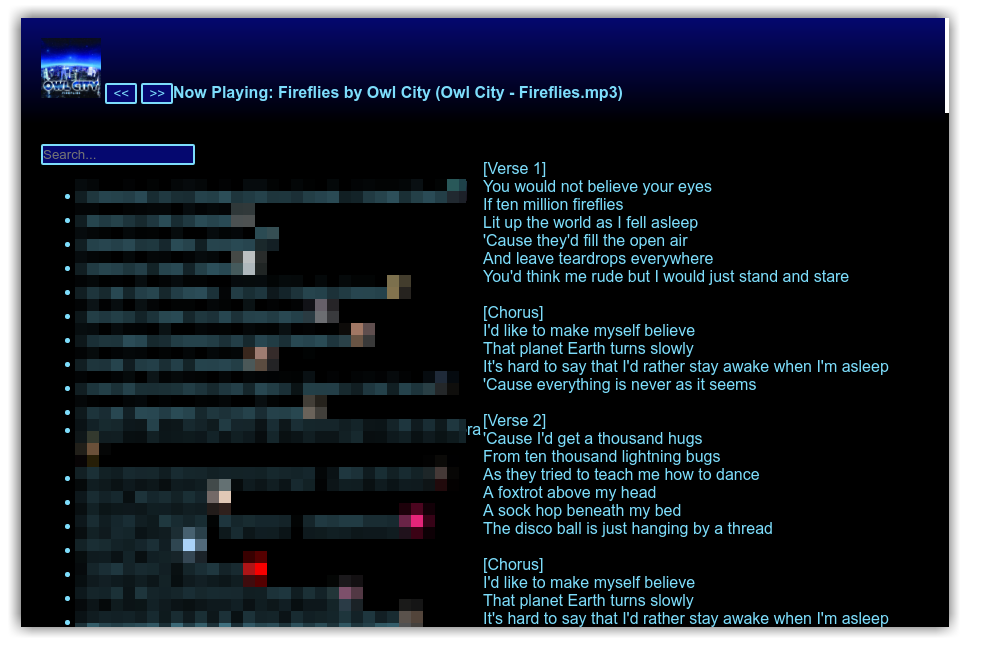

> Note: This project is very WIP.

# Electron Music Player

A simple music player in electron



Colors are set dynamically based on the 0th art of the song that is playing, enforcing a contrast ratio of at least 3:1

Songs are currently listed from `~/Music`

Lyrics are currently read from the Album field of the audio file.

## Setup

```bash
# Clone this repository
git clone https://github.com/pfgithub/electron-music-player
# Go into the repository
cd electron-music-player
# Install dependencies
yarn install
# Run the app
yarn start
```