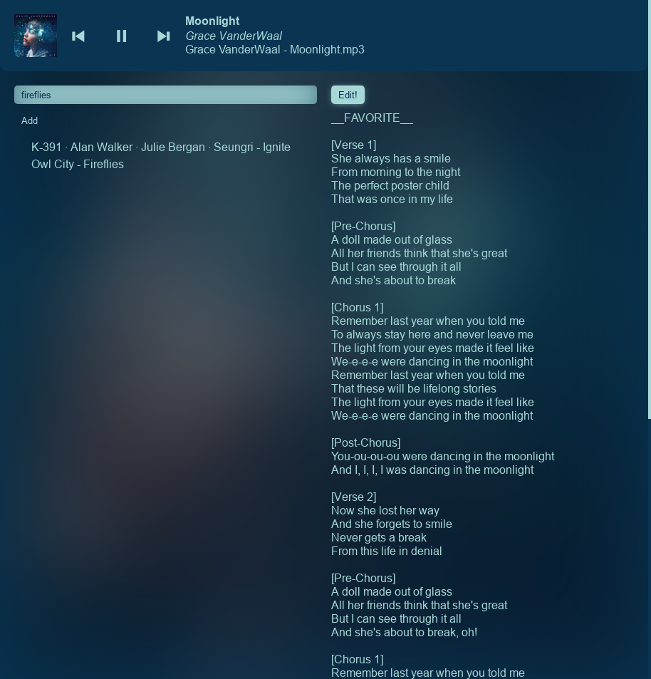
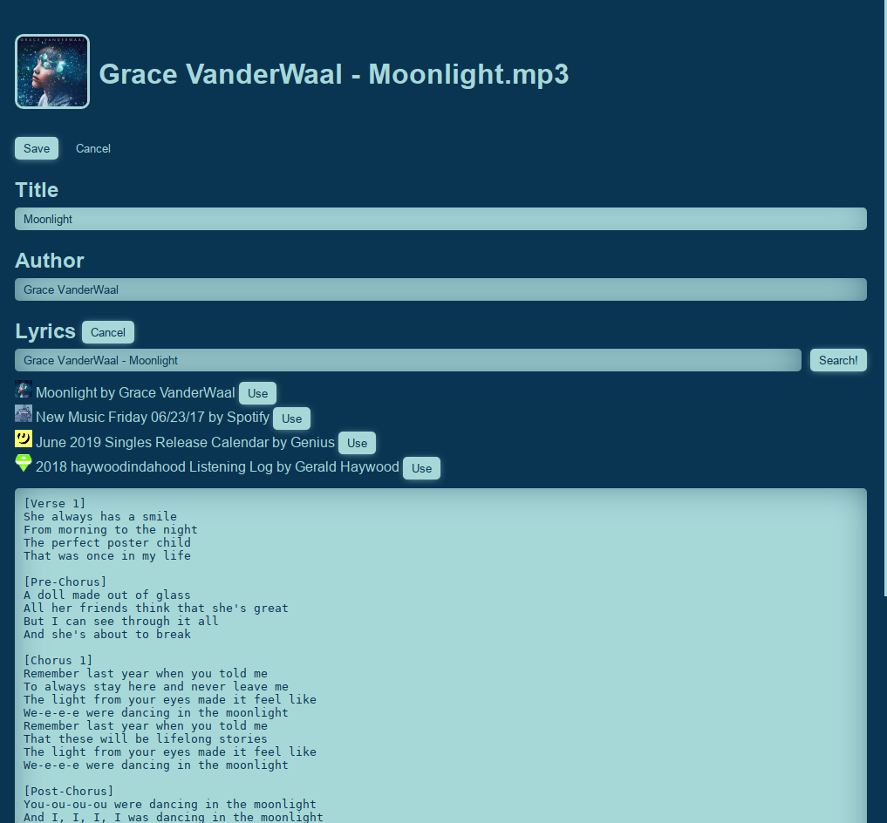

# electron-music-player

A simple music player in electron





Music is loaded from ~/Music/\*\*\*.mp3 by default.

Supports linux and maybe other operating systems if you're lucky.

## Usage

```
# Clone this repository
git clone https://github.com/pfgithub/electron-music-player
# Go into the repository
cd electron-music-player
# Install dependencies
yarn install
# Build the app
yarn build
# Run the app
yarn start
```

### Edit Button

Edit lyrics and album art

Requires:

- ffmpeg
- a writable `/tmp` dir for setting album art (TODO fix)
- a scroll wheel (the scrollbar is broken, TODO fix)

### Add Button

Add music.

Choose whether to copy from a local file or download from youtube-dl.

Requires:

- `youtube-dl` and `ffmpeg` if used on a youtube video
- `sox` if tempo is not set to 1.0
- coreutils (`mv`, `[`)

### OS support

Supports linux and maybe mac and probably not windows.

### Search options

Start a search with `!` to match exact text. Start a search with `/` to match regex (slow).

### Music list sidebar

Click the thing to skip to the end of the queue and play immediately, press the `+` button to add to the end of the queue.

### Global hotkeys

Configure a global hotkey manager, eg

- mac: skhd
- windows: google.com
- linux: idk, I'm using ckb-next for single keys and i3 for hotkeys

Then, bind keys of your choosing to:

`node /path/to/electron-music-player/src/ipc.js [command]`

command can be any of: `playpuase`, `next`, `prev`, `play`, `pause`, `randomfiltertoggle`, `randomfilteron`, `randomfilteroff`

I have scroll lock/pause break bound to prev/next, page up bound to playpause, and page down bound to randomfiltertoggle.

## Contributing

Use `yarn build-watch` to automatically build when you change a file. Use an editor plugin to see typescript errors (also don't use atom because it will run at <15fps)

Likely the only file you have to edit is `src/player.ts`. The window is created in `src/main.ts`, so edit that if you need to create new windows or adjust hotkeys.

## TODO

things that might be done in the future if I ever get too tired of not having them:

- option to load album art from a local file
- option to load album art from the clipboard
- sort the sidebar
- highlight search match locations in the lyrics display
- add the ability to trim audio files (interactive editor - pick start and end location, test that start and end locations are correct, trim by running ffmpeg)
- ui improvements, especially for the edit and add pages so they don't look so disorganized.

things that would be good to do but I probably won't ever need:

- use mktempdir instead of `/tmp` for writing album art
- update metadata on play to prevent outdated things from showing
- show the duration and a scrubber for playing things
- support non-mp3 files
- ability to choose the folder it loads things from
- tagging and stuff (manual text tags are good enough for now, I would want real tagging to use a seperate data file/database so adding a tag does not rewrite the mp3 file)
- shuffle weighting and ability to set a shuffle target or something. oh and don't play the same thing twice in a row.
